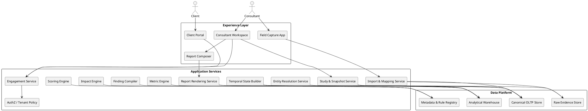
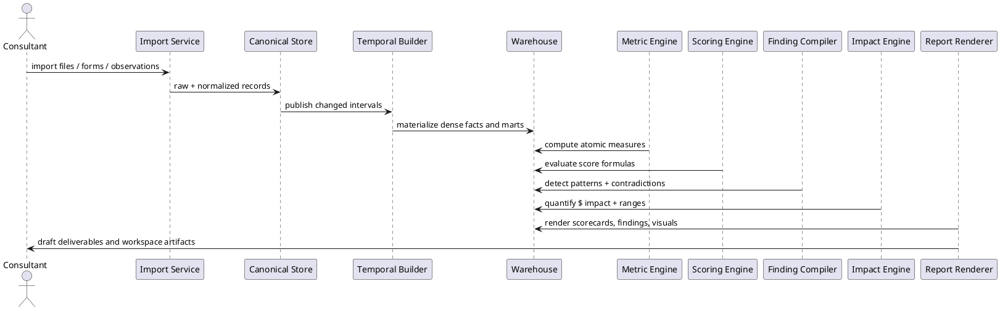
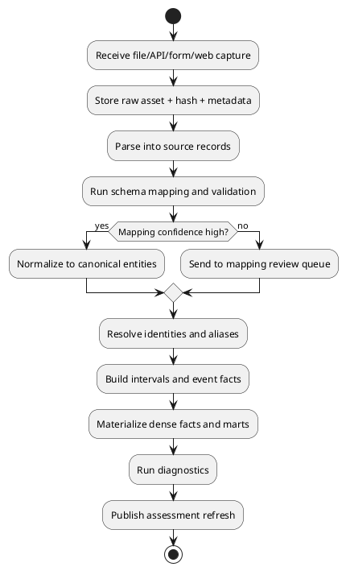

# SPEC-1-Multifamily Property Assessment Platform

## Background

This platform exists to systematize a multifamily operations consulting practice whose value comes from **joining evidence that normally lives in different systems, different people, and different moments in time**. The platform is not a dashboard over PM exports. It is a full diagnostic machine for a property engagement.

The business process described in the source brief combines PM system exports, CRM/leasing data, vacant unit audits, field validation observations, mystery shops, resident interviews, listing reviews, marketing observations, and competitive market intelligence into one diagnostic method. The platform therefore has to do four things simultaneously:

1. Preserve and normalize highly heterogeneous data.
2. Reconstruct the operational reality of the property over time, especially at the **unit** level.
3. Produce a **complete autonomous diagnosis** with findings, scoring, contradiction detection, and financial impact quantification.
4. Give the consultant a research workbench to inspect, challenge, extend, and package the system’s output.

The most important modeling constraint in the brief is that **every unit must exist analytically for every day it exists physically**, even when no lease event, work order event, or operational event occurred during the period. A unit that sat idle for 180 days is often more important than a unit with many events. This design therefore treats the property as a **time-varying unit universe**, not as a collection of events.

The second defining principle is that the platform must never intentionally stop at “partial analysis.” If enough data exists to evaluate an area, the system should finish the analysis on its own. If some source is missing, the system should say so explicitly, mark scope and confidence, and still fully analyze all in-scope domains.

---

## Requirements

### Must Have

#### Core platform behavior
- **M1. Complete autonomous diagnosis.** The system must run end-to-end diagnostics on all available data and output findings, grades, root-cause hypotheses, quantified impact, and recommended actions without relying on a consultant to complete missing analytical work.
- **M2. Unit-complete temporal model.** Every physical unit must be represented across time, even with no events, so vacancy, occupancy, condition, price position, and status can be analyzed continuously.
- **M3. Current-state and historical analysis.** The platform must support both point-in-time views and longitudinal analysis for all domains.
- **M4. Cross-source analytics.** PM, CRM, field, mystery shop, listing, marketing, resident interview, and competitive data must be analyzable together at shared grains.
- **M5. Full analytical access.** All stored data must be queryable through guided analysis, diagnostics, and open-ended ad hoc analysis.
- **M6. Extensible methodology.** New analyses, new data sources, new scoring rubrics, and new diagnostic patterns must be addable without schema redesign.

#### Data management
- **M7. Raw evidence preservation.** Every imported file, scraped page, photo, transcript, and form submission must be preserved with provenance and hash.
- **M8. Canonical model plus extensibility.** The platform must standardize common entities while allowing source-specific fields and future domains.
- **M9. Bitemporal history.** The system must preserve both effective time and record time so prior assessments remain reproducible after corrections or late-arriving data.
- **M10. Data contradiction tracking.** The platform must explicitly detect and store contradictions between system records and field reality.

#### Analytical domains
- **M11. Vacancy and turnover diagnostics**
- **M12. Make-ready and maintenance diagnostics**
- **M13. Leasing and CRM diagnostics**
- **M14. Listing quality diagnostics**
- **M15. Marketing diagnostics**
- **M16. Pricing and revenue diagnostics**
- **M17. Retention and renewal diagnostics**
- **M18. Competitive position diagnostics**
- **M19. Property condition diagnostics**
- **M20. Financial impact quantification for every material finding**

#### Workflow and UX
- **M21. Consultant workspace.** Imports, field capture, diagnostics, ad hoc analysis, studies, report building, and assessment comparison must live in one workspace.
- **M22. Client portal.** Clients must see approved results, recommendations, score trends, and selected reports without exposing consultant-only tools.
- **M23. Studies and snapshots.** Saved analyses, frozen result sets, comparison boards, and reusable investigative workspaces are first-class objects.
- **M24. Reporting and deliverables.** The system must generate polished standard and custom reports directly from system results.
- **M25. Door opener mode.** The same platform must run a public-data-only assessment with meaningful analysis and presentation value.
- **M26. Ongoing assessments.** All assessments, findings, scores, recommendations, and evidence must persist and compare over time.

#### Security and operations
- **M27. Multi-tenant security.** Consultant firm, client, portfolio, property, and assessment scopes must be enforced.
- **M28. Auditability.** Any number in a report must be traceable to source evidence, transformation version, and analytical rule version.
- **M29. Reproducibility.** Re-running an old assessment with the same inputs and rule versions must produce the same result.
- **M30. Scalable performance.** The platform must support large portfolios, dense daily unit histories, and large volumes of listing observations.

### Should Have
- **S1. Mobile-friendly field capture** for vacant unit walks, mystery shops, and site observations.
- **S2. Recommendation implementation tracking** across recurring assessments.
- **S3. Confidence scoring** separated from performance scoring.
- **S4. Scenario modeling** for rent lift, vacancy recovery, concession policy, and retention improvement.
- **S5. Embedded BI / SQL workspace** for power-user analysis by consultants.
- **S6. Automated ingestion orchestration** for connectors and repeat imports.
- **S7. Competitive set versioning** so the same property can have different comp sets over time.

### Could Have
- **C1. Transcription and sentiment extraction** for interviews and recorded calls.
- **C2. Computer vision assistance** for photo quality scoring and condition detection.
- **C3. Alert subscriptions** for clients between formal assessments.
- **C4. Write-back integrations** to PM/CRM systems for recommendation status or task creation.
- **C5. Benchmark sharing across consultant portfolios** using anonymized reference data.

### Won’t Have in MVP
- **W1. Direct operational control of PM/CRM workflows** such as leasing communications or maintenance dispatch.
- **W2. Autonomous competitive web crawling across every source with no review.** Public data collection can be automated, but reviewed and legally compliant ingestion remains the default.
- **W3. Black-box scoring with no evidence trail.** Every score and finding must remain inspectable.

---

## Method

### 1. Design principles

1. **Evidence first.** Raw evidence is never overwritten or discarded. Derived facts are reproducible from preserved inputs.
2. **Temporal before analytical.** The platform first reconstructs “what existed and when,” then computes metrics. This prevents invisible units and false absence.
3. **Canonical core, flexible edges.** Common multifamily entities get strong schema; sparse or source-specific attributes live in typed extension tables and JSON payloads.
4. **Diagnostics as versioned packages.** Each analytical domain ships as a package containing inputs, metrics, rules, impact models, narratives, and recommendations.
5. **One engine, different scopes.** Full assessments and door openers use the same engine, with an applicability matrix deciding which domains are scored.
6. **Score != confidence.** Performance, evidence coverage, and certainty are stored separately so weak data never masquerades as strong performance.
7. **Human value is interpretive, not clerical.** The consultant refines, investigates, and persuades; the platform still completes the analytical labor on its own.

### 2. Reference architecture

The recommended MVP architecture uses four storage/compute layers:

1. **Object storage** for raw evidence and frozen snapshots.
2. **PostgreSQL** for canonical application data, workflow, security, and bitemporal entities.
3. **ClickHouse** for dense analytical facts, fast slicing, benchmarking, and trend queries.
4. **Python analysis services** for metric computation, rule execution, scoring, and report rendering.

**Why this stack**
- PostgreSQL is the transactional system of record and supports mature relational modeling, JSONB flexibility, and row-level security.
- ClickHouse is the analytical engine for dense daily facts, large observation tables, and pre-aggregated score marts.
- Object storage keeps evidence immutable, cheap, and exportable.
- Python is the practical implementation language for parsing, analytics, rule engines, and report generation.

**Trade-off**
This is more complex than a single-database app, but the complexity is justified because the platform has both OLTP needs (engagement workflow, permissions, forms, report composition) and OLAP needs (dense time-series, large comparative scans, multi-dimensional drilldowns). Trying to force both workloads into only one store would either slow the workspace or oversimplify the model.



### 3. Data architecture

#### 3.1 Four-layer data model

##### Layer A — Raw evidence
Purpose: preserve imported and observed truth exactly as received.

Examples:
- PM export CSV/XLSX/PDF bundles
- CRM exports or API payloads
- listing page HTML / screenshots / scraped JSON
- field photos and video
- mystery shop forms or call transcripts
- resident interview notes or audio transcripts
- competitor observations
- generated snapshots used in reports

Key tables / objects:
- `source_system`
- `source_ingestion`
- `source_asset`
- `source_record_raw`

##### Layer B — Canonical operational model
Purpose: standardize reusable entities and preserve business logic.

Examples:
- properties, buildings, units, leases, residents
- leads, tours, applications, agents
- work orders, vendors, invoices
- listings, channels, marketing campaigns
- mystery shops, audits, interviews, field observations
- competitors and competitor listing observations
- assessments, studies, scores, findings, reports

##### Layer C — Analytical Facts (ClickHouse)
Purpose: provide fast, consistent grains for analysis.

Examples:
- `fact_unit_day`
- `fact_lease_interval`
- `fact_vacancy_cycle`
- `fact_work_order`
- `fact_lead_funnel_event`
- `fact_listing_observation`
- `fact_marketing_presence_day`
- `fact_comp_listing_observation`
- `fact_score_result`
- `fact_finding_impact`

##### Layer D — Reproducible outputs
Purpose: persist the exact results seen by consultant or client.

Examples:
- saved query definitions
- frozen result snapshots
- report sections and rendered documents
- assessment scorecards
- comparison boards

#### 3.2 Canonical entity model

The model is organized around six top-level domains:

1. **Asset domain** — portfolio, client, property, building, unit, floor plan.
2. **Resident and lease domain** — residents, households, leases, renewals, notices, move-outs, delinquency, collections.
3. **Operations domain** — work orders, make-ready cycles, vendors, staff, budgets, financials, field validations.
4. **Demand domain** — leads, traffic sources, communications, tours, applications, leases, marketing campaigns, listing assets.
5. **Market domain** — competitors, comp properties, comp unit/floorplan observations, concessions, public marketing.
6. **Assessment domain** — assessments, diagnostics, scores, findings, impacts, recommendations, studies, reports.

#### 3.3 The critical modeling decision: unit spine + dense daily state

The system needs both:
- **event tables** for what happened, and
- **dense state tables** for what existed even when nothing happened.

The canonical solution is:

1. Maintain a durable **unit identity** (`unit_id`) that survives source-system changes.
2. Track physical/configuration changes in **unit version** intervals.
3. Track whether the unit exists in the property during a period in **unit existence intervals**.
4. Materialize a dense **unit-day state fact** for every day the unit exists.

This combination supports:
- units with no events
- units that are offline for renovation
- units renumbered or reconfigured
- side-by-side historical and current analysis
- time alignment across PM, CRM, listings, and field evidence

##### Key core tables

| Table | Purpose | Notes |
|---|---|---|
| `property` | Subject or competitor property master | Multi-tenant scoped |
| `building` | Building / section / phase hierarchy | Optional levels supported |
| `unit` | Durable unit identity | Stable surrogate key |
| `unit_version` | Time-bounded attributes | Building, floor, sqft, bed/bath, label, finish package |
| `unit_existence_interval` | When the unit physically exists and is rentable / non-rentable | Supports demolition, offline renovation, model units |
| `unit_alias` | Maps source keys and historical labels to `unit_id` | Handles renumbering and system migrations |
| `calendar_day` | Dense date dimension | Shared across facts |
| `fact_unit_day` | One row per unit per day of existence | Core state spine |
| `lease` / `lease_interval` | Lease terms and active coverage | Resident / rent / concession / dates |
| `work_order` | Maintenance and make-ready tasks | Vendor and cost detail |
| `vacancy_cycle` | Canonical turnover cycle | Move-out to move-in with phase boundaries |
| `listing_observation` | Subject unit listing snapshots | Channel, content, price, availability, quality |
| `comp_listing_observation` | Competitor unit/floorplan observations | Observation grain, not assumed perfect identity |
| `mystery_shop` | Structured leasing-experience evidence | Subject and competitors |
| `vacant_unit_audit` | Field condition and readiness evidence | Unit-level |
| `resident_interview` | Move-in experience evidence | Resident-level or anonymized household-level |
| `finding`, `score_result`, `impact_estimate` | Diagnostic outputs | Versioned by rule set |
| `study`, `saved_query`, `result_snapshot` | Investigative workspace | Reproducible |

##### Example core schema

```sql
create table unit (
  unit_id uuid primary key,
  property_id uuid not null,
  unit_natural_key text not null,
  created_at timestamptz not null,
  retired_at timestamptz null,
  unique (property_id, unit_natural_key)
);

create table unit_version (
  unit_version_id uuid primary key,
  unit_id uuid not null references unit(unit_id),
  valid_from date not null,
  valid_to date null,
  building_id uuid null,
  floor_label text null,
  unit_label text not null,
  floorplan_code text null,
  bedrooms numeric(4,1) null,
  bathrooms numeric(4,1) null,
  sqft integer null,
  finish_package text null,
  attributes jsonb not null default '{}'::jsonb,
  recorded_from timestamptz not null,
  recorded_to timestamptz null
);

create table unit_existence_interval (
  interval_id uuid primary key,
  unit_id uuid not null references unit(unit_id),
  valid_from date not null,
  valid_to date null,
  existence_status text not null,  -- active, offline_reno, model, demolished, combined, split
  rentable_flag boolean not null,
  reason_code text null,
  recorded_from timestamptz not null,
  recorded_to timestamptz null
);

create table fact_unit_day (
  property_id uuid not null,
  unit_id uuid not null,
  day_date date not null,
  unit_version_id uuid not null,
  existence_status text not null,
  rentable_flag boolean not null,
  occupancy_state text not null,   -- occupied, notice, vacant, leased_not_moved_in, offline
  readiness_state text not null,   -- unknown, not_ready, make_ready, ready_show, ready_lease
  marketing_state text not null,   -- unlisted, listed, application_pending, leased
  active_lease_id uuid null,
  active_listing_id uuid null,
  days_vacant integer null,
  asking_rent numeric(12,2) null,
  effective_rent numeric(12,2) null,
  concession_value numeric(12,2) null,
  condition_score numeric(5,2) null,
  contradiction_flags jsonb not null default '[]'::jsonb,
  evidence_coverage jsonb not null default '{}'::jsonb,
  primary key (unit_id, day_date)
);
```

##### How `fact_unit_day` is built

For each unit:

1. Determine all dates on which the unit physically exists.
2. Generate one row per day in that interval.
3. Join effective intervals from leases, notices, make-ready status, listings, field audits, and manual overrides.
4. Carry forward last-known state only where carry-forward is logically valid.
5. Mark unknowns explicitly when evidence is missing.
6. Store source coverage flags so analysts can distinguish “no activity” from “no visibility.”

Pseudo-logic:

```sql
for each unit_existence_interval
  generate day_date series
  resolve applicable unit_version
  resolve occupancy interval
  resolve readiness interval
  resolve listing interval
  resolve condition observation
  compute derived counters (days_vacant, days_listed, etc.)
  emit fact_unit_day row
```

**Why this is the right trade-off**

A dense daily fact consumes more storage than event-only modeling, but it dramatically simplifies the analysis the brief requires:

- vacancy without event activity stays visible
- unit-by-unit comparison becomes natural
- multi-source joins align on a shared grain
- trend queries avoid complex interval reconstruction every time
- assessments can freeze a precise daily state for reproducibility

Given multifamily unit counts, this density is operationally reasonable. A 400-unit property over 3 years produces about 438,000 unit-day rows before auxiliary facts, which is well within modern OLAP norms.

#### 3.4 Event facts still matter

Dense state does not replace events. It is derived from them and enriched by them. The event model includes:

- `lease_event` and `lease_interval`
- `notice_event`
- `move_event`
- `renewal_offer`
- `payment_event`
- `delinquency_snapshot`
- `work_order`
- `work_order_status_event`
- `make_ready_cycle`
- `lead_event`
- `communication_event`
- `tour_event`
- `application_event`
- `listing_observation`
- `marketing_observation`
- `mystery_shop_event`
- `field_observation_event`

The principle is:
- use **events** for causality and detail
- use **dense facts** for cross-domain analysis and time slicing

#### 3.5 Extensibility strategy

This platform should not use an EAV model for everything. That would make the analytical model brittle and slow. Instead:

- stable business entities get typed columns
- sparse or vendor-specific fields go into `attributes jsonb`
- new analytical domains add new fact tables and new rule packages
- all facts register metadata in a semantic catalog: grain, keys, dimensions, measures, lineage, and version

This gives structure without blocking growth.

### 4. Domain model details

#### 4.1 Asset and property hierarchy

```text
Consultant Org
  -> Client
    -> Portfolio (optional)
      -> Property
        -> Building / Phase / Section (optional hierarchy)
          -> Unit
```

A property can have changing comp sets, changing staffing, and multiple assessments over time.

#### 4.2 Leasing and CRM model

Key entities:
- `lead`
- `lead_source`
- `agent`
- `communication_touch`
- `tour`
- `application`
- `quote`
- `lost_deal_reason`
- `crm_assignment_interval`

Important design choice:
The system stores both **pipeline events** and **assignment intervals** so performance can be analyzed by:
- source
- agent
- time period
- unit type requested
- response SLA window
- final outcome

This supports questions such as:
- which traffic sources feed which agents
- whether expensive sources are routed to weak performers
- whether poor response time and mystery shop weakness point to the same staffing issue

#### 4.3 Maintenance and make-ready model

Key entities:
- `work_order`
- `work_order_line_item`
- `vendor`
- `staff_member`
- `make_ready_cycle`
- `unit_condition_observation`
- `field_validation`
- `budget_actual_line`

Important design choice:
A **make-ready cycle** is its own object, not something inferred fresh for every query. It groups all related unit turn tasks and stores canonical phase boundaries:

- move-out
- notice received
- make-ready start
- make-ready complete in PM
- ready observed in field
- first listing
- first tour / first showing
- application
- lease signed
- move-in

That makes bottleneck analysis deterministic and easy to compare.

#### 4.4 Listing and marketing model

The brief distinguishes **marketing** from **listings**, so the model does too.

##### Marketing domain (property-level)
- `marketing_channel`
- `campaign`
- `campaign_spend`
- `website_observation`
- `social_observation`
- `brand_observation`
- `channel_presence_day`

##### Listing domain (unit-level content)
- `listing`
- `listing_observation`
- `listing_asset` (photos, floor plans, video)
- `listing_review`
- `historical_listing_linkage` for occupied units when last leased

Important design choice:
Listings are modeled as **observations over time**, not as one mutable row. This allows the system to score:
- changes in quality over time
- price/availability edits
- concession changes
- historical marketing quality for currently occupied units

#### 4.5 Competitive market model

Competitor data is inherently messier than subject-property data. Public data may identify a specific unit, a floor plan, or only an offer. The model therefore separates identity confidence from observation.

Key entities:
- `competitive_set`
- `competitor_property`
- `competitor_property_version`
- `comp_floorplan`
- `comp_listing_observation`
- `comp_property_observation`
- `comp_mystery_shop`
- `comp_marketing_observation`

Important design choice:
Competitor unit observations should not assume perfect canonical unit identity. The safe grain is **observation of an offered unit/floorplan at a timestamp with confidence metadata**. Where the same unit can be matched over time, the platform may link observations, but only with a confidence score.

#### 4.6 Assessment and deliverable model

- `assessment`
- `assessment_scope`
- `assessment_data_coverage`
- `analysis_run`
- `scorecard`
- `score_result`
- `finding`
- `impact_estimate`
- `recommendation`
- `report`
- `report_section`
- `report_render`

Important design choice:
All outputs are versioned by:
- source coverage
- transformation version
- rule package version
- benchmark version

Without this, cross-assessment comparisons become untrustworthy.

### 5. Analytical engine

The engine has three modes, all backed by the same semantic model.

#### 5.1 Mode A — Fundamental analytical platform
Purpose: arbitrary lookups, pivots, rollups, drilldowns, and comparisons.

Examples:
- average vacancy days by building and floorplan
- leases signed by source and agent by month
- units with concessions above market median
- work-order cost by vendor for units with bad field scores

#### 5.2 Mode B — Predefined diagnostics
Purpose: run the consultant’s standardized methodology for every engagement.

Each **diagnostic package** contains:
- required and optional inputs
- grain
- derived features
- benchmarks
- score formulas
- finding conditions
- contradiction logic
- impact models
- recommendation templates
- narratives and chart specs

Example package names:
- `vacancy.turn_cycle`
- `operations.make_ready_quality`
- `leasing.crm_response`
- `leasing.shop_alignment`
- `listings.presentation_quality`
- `marketing.channel_effectiveness`
- `pricing.market_position`
- `retention.renewal_discipline`
- `condition.ready_truthfulness`
- `market.subject_vs_competitors`

#### 5.3 Mode C — Ad hoc analysis
Purpose: analyst freedom beyond predefined packages.

The consultant workspace exposes:
- guided query builder
- SQL editor on governed marts
- saved query library
- reusable chart specs
- parameterized comparisons

This is how the consultant follows new threads without waiting for engineering.

#### 5.4 Engine pipeline



#### 5.5 How the engine becomes “complete” instead of partial

Every diagnostic package returns one of four statuses:

- `PASS`
- `WATCH`
- `FAIL`
- `OUT_OF_SCOPE`

It does **not** return “not analyzed” for an in-scope domain.

Each package also returns:
- `coverage_pct`
- `confidence_score`
- `evidence_count`
- `benchmark_basis`
- `financial_impact_status` (`estimated`, `not_material`, `not_possible_due_to_scope`)

This produces a **completeness contract**:
- every in-scope domain is evaluated
- missing inputs are surfaced as scope or confidence constraints, not silent omissions
- every material issue gets a quantified impact, or an explicit reason why it cannot be quantified

#### 5.6 Cross-domain diagnostics

The most important analyses are graph-like rather than flat. The engine therefore uses a **finding graph**:

- nodes = units, leases, agents, listings, vendors, buildings, channels, competitors, findings
- edges = relationships and temporal overlap
- weights = strength of evidence

Example:
- Unit 12B had 83 vacant days
- make-ready vendor X exceeded turn benchmark by 9 days
- field audit says “ready” was false
- listing score is in bottom decile
- lead response times for first 14 listed days were below SLA
- competitor comps were priced lower with higher listing scores

The engine turns this into:
- primary finding: “turnover and presentation failure on 12B”
- contributing causes: vendor delay, false-ready status, weak listing quality, delayed leasing response, above-market pricing
- quantified impact: avoidable vacancy loss + avoidable concessions
- confidence: 0.86
- evidence bundle: links to all supporting rows and artifacts

This is more useful than emitting five isolated metric warnings.

#### 5.7 Domain packages as full analytical domains

The following domains are treated as first-class citizens, not supporting tables:

| Domain | Primary grain | Key facts | Example outputs |
|---|---|---|---|
| Vacancy & Turnover | unit, vacancy cycle, unit-day | lease intervals, make-ready, listing timing | phase bottlenecks, chronic units, avoidable loss |
| Maintenance & Make-ready | work order, make-ready cycle, vendor | work orders, costs, field validation | vendor scorecards, backlog, false completion |
| Leasing & CRM | lead, agent, source, day | leads, touches, tours, apps, shops | conversion, response quality, staffing findings |
| Listing Quality | listing observation, unit, channel | listing reviews, assets, DOM | listing score, accuracy mismatch, comp comparison |
| Marketing | property, channel, campaign, day | spend, channel presence, web/social reviews | channel ROI, missing presence, misaligned spend |
| Pricing & Revenue | unit-day, lease, comp observation | asking rent, effective rent, comps, concessions | market position, underpricing, concession efficiency |
| Retention & Renewals | lease, renewal offer, resident | offers, reasons, delinquency, complaints | renewal timing, churn causes, bad-fit rent increases |
| Competitive Position | property, comp set, floorplan | comp listings, comp shops, comp observations | value/premium/mispositioned diagnosis |
| Property Condition | unit audit, field obs, building | field audits, readiness, common areas | readiness truthfulness, building issue clusters |
| Data Integrity & Contradictions | entity-day / event | PM vs field vs CRM vs public evidence | contradictions, trust penalties, evidence gaps |

### 6. Scoring and grading system

#### 6.1 Score architecture

Every score result has these components:

- `metric_value`
- `normalized_value_0_100`
- `benchmark_type`
- `benchmark_reference`
- `entity_scope`
- `weight`
- `confidence_score`
- `coverage_score`
- `grade_letter`
- `version`

Benchmarks come from four sources:

1. **Operational standard** — internal standard or accepted target (e.g., first response under X minutes).
2. **Competitive benchmark** — subject property vs current comp observations.
3. **Internal relative benchmark** — vs property peers, buildings, floorplans, or historical self.
4. **Predictive expectation** — expected result given condition, unit type, seasonality, and market context.

Important design choice:
The score system must support both **absolute** and **relative** grading. A 6-day make-ready could be an A by internal standard but a C relative to strong competitors; both matter.

#### 6.2 Score hierarchy

```text
Atomic metric
  -> indicator score
    -> domain score
      -> assessment summary score
```

Example for Leasing:
- atomic: median first response minutes
- atomic: touch count within 7 days
- atomic: lead-to-tour rate
- atomic: shop greeting score
- atomic: tour close score
- atomic: lost-to-competitor rate

These roll into:
- responsiveness
- follow-up discipline
- conversion effectiveness
- presentation quality
- competitive effectiveness

Then into:
- overall leasing score

#### 6.3 Contradiction penalties and overrides

Some findings should not just lower a metric; they should trigger a diagnostic override.

Examples:
- PM “ready” but field says “not ready”
- PM work order complete but field says incomplete
- CRM shows timely touches but mystery shop reveals poor quality
- listed available but audit says unshowable

These create:
- contradiction findings
- trust penalties on affected scorecards
- elevated severity because false data changes decisions

#### 6.4 Score vs confidence vs scope

The platform stores three separate views:

- **Performance score** — how good or bad the operation is
- **Confidence score** — how trustworthy the conclusion is
- **Scope flag** — whether the domain was eligible in this assessment

This avoids a common analytical mistake where missing data quietly depresses or inflates performance.

#### 6.5 Grade mapping

Use a 0–100 normalized scale plus letter bands, for example:

- A: 93–100
- A-: 90–92
- B+: 87–89
- B: 83–86
- B-: 80–82
- C+: 77–79
- C: 73–76
- C-: 70–72
- D: 60–69
- F: <60

The exact bands are metadata, not code. Different scorecards can use different bands if needed.

#### 6.6 Versioned rubrics

All score formulas, weights, and thresholds must be versioned. A new methodology release should not rewrite history; it should create a new rubric version and optionally re-score prior assessments in a separate comparison view.

### 7. Financial impact engine

#### 7.1 Impact model catalog

Every material finding binds to one or more reusable impact models:

- `vacancy_loss`
- `avoidable_turn_delay`
- `below_market_rent_loss`
- `concession_leakage`
- `retention_failure_cost`
- `collections_loss_risk`
- `maintenance_overspend`
- `vendor_rework_cost`
- `marketing_waste`
- `pricing_misposition_cost`

Each model stores:
- formula
- required inputs
- optional refinements
- low/base/high assumption parameters
- double-count prevention rules
- narrative explanation

#### 7.2 Example formulas

**Avoidable vacancy loss**
```text
avoidable_days * stabilized_effective_daily_rent
```

**Below-market rent loss**
```text
(max(0, target_market_rent - actual_effective_rent)) * occupied_days
```

**Concession leakage**
```text
total_concession_value - estimated_incremental_lease_acceleration_value
```

**Retention failure cost**
```text
avoidable_move_outs * (turn_cost + expected_vacancy_loss + leasing_cost)
```

#### 7.3 Preventing double counting

The engine groups related impacts under a **finding family** and uses attribution rules.

Example:
- slow make-ready and overpricing may both contribute to the same 40 vacant days
- the engine should not book 40 days twice

Solution:
- `impact_family_id`
- `primary_driver_share`
- `contributing_driver_share`
- portfolio and assessment totals sum only net attributable amounts

#### 7.4 Output format

Every impact estimate returns:
- low / base / high dollars
- annualized equivalent when meaningful
- per-unit or per-incident breakdown
- formula trace
- assumption trace
- confidence

This makes the number usable in both consultant investigation and client persuasion.

### 8. Contradictions and validation engine

Contradictions are not just quality flags. They are diagnostic evidence.

The engine evaluates contradiction rules across matched entities and timestamps, such as:

- PM ready status vs field-ready observation
- work order complete vs observed issue unresolved
- PM occupancy vs observed vacancy / unit condition
- CRM touch logged vs mystery shop no meaningful engagement
- listing available vs no unit actually showable
- advertised amenities vs observed condition
- renewal offer discipline vs resident explanation of non-renewal

Each contradiction record includes:
- source A
- source B
- matching rule
- contradiction type
- severity
- evidence links
- affected domains
- trust penalty multiplier

This allows contradiction density itself to become a scorecard dimension.

### 9. Investigative workspace: studies, snapshots, comparisons

The workspace is a core product surface, not a saved-report feature.

#### 9.1 Core objects

| Object | Purpose |
|---|---|
| `saved_query` | Reusable query definition with parameters, filters, chart spec |
| `result_snapshot` | Frozen output of a query or diagnostic with data hash and rule versions |
| `study` | Named investigation container for a topic |
| `study_item` | Link between a study and snapshots, findings, notes, or comparisons |
| `comparison_board` | Side-by-side layout of selected results |
| `annotation` | Consultant notes tied to evidence or result cells |
| `evidence_bundle` | Curated set of rows, photos, listings, and findings for export |

#### 9.2 Snapshot semantics

A snapshot must preserve:
- source data version / ingestion ids
- transformation version
- analytical rule version
- benchmark version
- result payload
- chart spec
- SQL / semantic query definition
- filters
- creation timestamp
- creator

This lets the consultant return weeks later and see the exact same result.

#### 9.3 Study workflow

Typical workflow:
1. Run an analysis.
2. Freeze it as a snapshot.
3. Add related snapshots to a study.
4. Open a comparison board inside the study.
5. Annotate the evidence.
6. Promote selected artifacts into a report section.

This directly supports the consultant’s “follow threads” workflow from the brief.

### 10. Data intake and ingestion

#### 10.1 Intake channels

The platform must accept four ingestion patterns:

1. **File imports** — PM and CRM exports, budget files, rent rolls, delinquency files.
2. **API pulls** — where vendor APIs are available and allowed.
3. **Manual structured capture** — field audits, mystery shops, interviews, observations.
4. **Public-data collection** — listings, websites, social profiles, competitor observations.

#### 10.2 Ingestion pipeline



#### 10.3 Connector strategy

Use a connector registry with three adapter types:

- `file_parser`
- `api_connector`
- `manual_form`

Each connector declares:
- supported source type
- extraction schema
- mapping rules
- idempotency key
- required review steps
- quality checks

Important design choice:
Do not hard-code Yardi/Entrata/Knock-only tables into the application. Build **vendor-specific adapters** that land in a stable canonical model.

#### 10.4 Entity resolution

Critical matching problems:
- unit aliases / renumbering
- resident duplicates
- agent names that differ across CRM and mystery shop
- vendor name variants
- competitor observations with partial identity

Use deterministic matching first, then scored fuzzy matching with review thresholds. Always store:
- match method
- confidence
- reviewer override if applied

#### 10.5 Missingness and coverage modeling

Missing data is modeled explicitly through:
- `assessment_data_coverage`
- `domain_input_coverage`
- `fact evidence_coverage`
- `score confidence`

This prevents false interpretations such as “no listings” when the scrape failed.

### 11. Consultant and client interfaces

### 11.1 Consultant workspace

Modules:
1. **Engagement cockpit** — property, assessment, source coverage, run status.
2. **Import center** — upload, map, validate, and monitor ingestion.
3. **Field capture** — unit walks, mystery shops, common-area observations, competitor captures.
4. **Diagnostic hub** — scorecards, findings, contradictions, impact summaries.
5. **Analysis lab** — guided pivots, SQL, drilldowns, compare views.
6. **Studies** — saved investigations, boards, annotations, exports.
7. **Report composer** — template selection, section editing, evidence insertion.
8. **Assessment compare** — longitudinal score, finding, and recommendation tracking.

Important design choice:
The consultant UI should expose the platform’s depth without forcing power users into raw SQL for routine work. Guided exploration covers common investigations; SQL remains available for edge cases.

### 11.2 Client portal

Modules:
1. **Executive overview** — overall scores, trends, top findings, financial opportunity.
2. **Domain scorecards** — leasing, vacancy, pricing, retention, etc.
3. **Finding detail** — evidence-backed issues and recommendations.
4. **Progress tracking** — across assessments, by domain and recommendation.
5. **Report library** — delivered reports and exports.
6. **Limited explore** — pre-approved filters and comparisons only.

Important design choice:
Clients should never see consultant-only working notes, draft hypotheses, or unrestricted underlying PII. The client portal is a curated window on approved outputs.

### 12. Reporting and deliverable generation

#### 12.1 Report model

A report is composed of:
- template
- section definitions
- data bindings
- narratives
- charts / tables
- appended evidence

Each section can be sourced from:
- scorecards
- findings
- saved queries
- snapshots
- manual commentary
- recommendation sets

#### 12.2 Standard deliverables

MVP templates:
- full assessment report
- executive summary
- vacancy / turnover deep dive
- leasing effectiveness deep dive
- competitive market analysis
- progress tracking report
- door opener report

#### 12.3 Custom report creation

The consultant can create ad hoc report sections by selecting:
- a result set or snapshot
- a visual spec
- a narrative template
- optional custom written commentary

This is more powerful than fixed dashboards and still reproducible.

#### 12.4 Rendering pipeline

Recommended rendering flow:
1. Query bound data and images.
2. Render structured markdown / HTML sections.
3. Apply brand theme and layout.
4. Render to PDF and presentation-ready outputs.
5. Store rendered artifact and section manifest.

Important design choice:
Reports should be generated from system objects, not copy-pasted from spreadsheets. This preserves trust and repeatability.

### 13. Door openers as a distinct use case

Door openers are not a crippled demo. They are a real assessment type with a different applicability matrix.

#### 13.1 Door opener scope
Included:
- public unit-level listings
- pricing and concessions
- availability signals
- listing quality
- website and public marketing presence
- public social/brand presentation
- competitor comparisons
- public mystery shop if performed
- subject vs competitor market position

Excluded:
- PM internal operations
- CRM internals
- work orders
- internal financials
- resident interviews
- full field validation unless performed publicly/onsite

#### 13.2 Modeling approach

Use `assessment_type = DOOR_OPENER`.

The same domain packages run, but only those whose input requirements are satisfied are marked in scope. For example:
- `pricing.market_position` -> in scope
- `listings.presentation_quality` -> in scope
- `marketing.channel_effectiveness` -> partly in scope if spend is unavailable
- `operations.make_ready_quality` -> out of scope
- `retention.renewal_discipline` -> out of scope

#### 13.3 Why this matters

Using the same platform and score architecture means:
- the door opener is persuasive, not superficial
- the upgrade path to a full engagement is natural
- once internal data arrives, prior public findings remain comparable rather than being rebuilt from scratch

### 14. Ongoing assessments and longitudinal tracking

#### 14.1 Assessment as a first-class object

Each assessment stores:
- scope window
- site visit date(s)
- comp set version
- imported sources
- diagnostic package versions
- benchmark versions
- results
- final approved report artifacts

#### 14.2 Longitudinal model

Store trend-ready facts such as:
- `fact_assessment_score`
- `fact_assessment_finding`
- `fact_recommendation_status`
- `fact_property_kpi_period`
- `fact_unit_chronicity`

This supports:
- score trajectories
- recurring finding persistence
- recommendation adoption
- before/after impact comparisons

#### 14.3 Recommendation tracking

Recommendations should be structured objects with:
- domain
- target entity
- priority
- expected impact
- owner
- due date
- implementation status
- verification evidence

That allows the next assessment to evaluate both operational performance and execution discipline.

### 15. Extensibility without restructuring

#### 15.1 New data sources
Add a connector, map to canonical entities, and register source-specific attributes. Existing analyses continue to work.

#### 15.2 New analyses
Add a diagnostic package with:
- metric definitions
- benchmark definitions
- rule thresholds
- impact formulas
- output templates

No schema rewrite is required unless the new analysis introduces a truly new fact grain.

#### 15.3 New scoring patterns
Rubrics are metadata-driven. A new rubric version can be deployed independently of core entity tables.

#### 15.4 New domains
Add new canonical facts and register them in the semantic catalog. Existing workspace, studies, and reporting infrastructure remain reusable.

### 16. Security, governance, and reproducibility

#### 16.1 Tenant and data security
- consultant org, client, property, and assessment scopes
- role-based permissions
- row-level access at the transactional layer
- restricted marts for client access
- encryption in transit and at rest
- PII tagging and masking

#### 16.2 Lineage
Every metric, score, and finding stores:
- source fact references
- rule package version
- benchmark version
- computed timestamp
- assessment id

#### 16.3 Auditability
Every manual override stores:
- who changed it
- what changed
- why
- before/after value
- when it changed

#### 16.4 Reproducibility
A report can be reconstructed from:
- frozen snapshot ids
- source asset hashes
- transformation version
- diagnostic package version
- benchmark version

### 17. Edge cases and failure prevention

| Edge case | Design response |
|---|---|
| Unit has no events for months | `fact_unit_day` keeps it visible and analyzable |
| Unit renumbered mid-year | `unit_alias` and `unit_version` preserve continuity |
| Unit split or combined | new unit identities plus existence intervals with lineage links |
| PM export window misses older history | coverage tables mark limited historical confidence |
| Competitor listing identity uncertain | observation grain + confidence, not false precision |
| Lease signed then canceled | event model stores lifecycle, state builder resolves actual day-state |
| Unit marked ready but offline for renovation | existence interval `rentable_flag=false` prevents false vacancy math |
| Multiple CRMs or PM migrations | source system registry + entity resolution |
| Late-arriving corrected exports | bitemporal record storage preserves prior assessment reproducibility |
| Field audit and PM disagree | contradiction engine records conflict instead of overwriting one source |
| Missing listing history for occupied units | mark historical marketing coverage as partial, do not infer certainty |
| Public listing scraper fails | coverage flag prevents “no listings” misread |
| Same loss explained by multiple causes | impact family and attribution shares prevent double counting |

### 18. Similar applications and why this design is different

Adjacent systems exist, but each typically owns only part of the problem:

- PM platforms such as Yardi and Entrata unify leasing, operations, accounting, and resident workflows.
- Multifamily CRMs such as Knock focus on lead-to-lease funnel management, attribution, and marketing efficiency.
- Maintenance/inspection platforms such as HappyCo focus on inspections, turns, and maintenance execution.
- BI tools provide dashboards and ad hoc analysis but not domain-specific multifamily diagnostics with field validation and unit-complete temporal modeling.

This platform intentionally combines capabilities that are normally fragmented across:
- system-of-record operations
- CRM funnel analytics
- inspection and turn QA
- competitive intelligence
- consultant investigation workflow
- report authoring

The differentiator is not that it stores multifamily data. The differentiator is that it treats:
- **unit timeline reconstruction**
- **field-vs-system contradiction detection**
- **competitive unit-level benchmarking**
- **complete autonomous findings with quantified impact**
as the center of the product.

That is the combination the source brief requires, and it is not well served by stitching together off-the-shelf tools alone.

---

## Implementation

### Phase 0 — Foundations
1. Establish tenancy, identity, auth, and property/assessment model.
2. Stand up object storage, PostgreSQL, analytical warehouse, and workflow orchestration.
3. Create source registry, ingestion job model, and raw evidence store.
4. Implement audit logging and version registries.

### Phase 1 — Canonical core and import framework
1. Build canonical asset, lease, resident, vendor, and staff schemas.
2. Build file import framework with schema mapping UI and review queue.
3. Implement first connectors for PM exports, CRM exports, and manual field forms.
4. Add entity resolution and alias mapping.
5. Persist coverage metadata and source provenance.

### Phase 2 — Temporal unit spine
1. Build `unit`, `unit_version`, `unit_existence_interval`, and alias model.
2. Implement interval resolvers for occupancy, notice, readiness, listing, and pricing.
3. Materialize `fact_unit_day`.
4. Build vacancy cycle and make-ready cycle facts.
5. Validate against sample properties with units that had no events.

### Phase 3 — Core diagnostics
1. Implement metric registry and benchmark registry.
2. Ship domain packages for:
   - vacancy/turnover
   - make-ready/maintenance
   - leasing/CRM
   - listing quality
   - pricing/revenue
   - competitive position
   - property condition
3. Implement contradiction engine.
4. Implement scorecards and impact model catalog.
5. Build evidence-backed finding compiler.

### Phase 4 — Workspace and reporting
1. Build diagnostic hub and drilldown pages.
2. Build studies, snapshots, comparison boards, and annotations.
3. Build report template system and rendering pipeline.
4. Add export formats and evidence bundles.
5. Pilot with consultant on live engagements.

### Phase 5 — Client portal and longitudinal tracking
1. Build client portal with approved scorecards, findings, trends, and report library.
2. Add recommendation tracking and follow-up assessment compare views.
3. Build trend marts and recurring finding logic.
4. Add property trajectory dashboards.

### Phase 6 — Door opener and extensibility
1. Add `DOOR_OPENER` assessment type and applicability matrix.
2. Add public listing/marketing collection workflow.
3. Add additional diagnostic packages for public-data-only analyses.
4. Publish connector SDK / package SDK for future extensions.

### Suggested delivery team
- 1 product-minded architect / tech lead
- 2 full-stack engineers
- 1 data engineer / analytics engineer
- 1 front-end engineer
- 1 QA / data validation analyst
- Consultant as domain owner for rubric and output validation

---

## Milestones

### Milestone 1 — Ingestion and temporal foundation
**Exit criteria**
- PM and CRM files ingest successfully
- raw evidence preserved
- unit identity and dense unit-day state are working
- analyst can query every unit for every day in scope

### Milestone 2 — Autonomous first-wave diagnostics
**Exit criteria**
- core domain packages run automatically
- scorecards and findings generate with evidence links
- contradiction engine identifies PM vs field mismatches
- impact engine produces quantified opportunity estimates

### Milestone 3 — Consultant workbench
**Exit criteria**
- studies, snapshots, comparison boards, and ad hoc analysis are functional
- consultant can build a full engagement inside the platform
- exports are stable and reproducible

### Milestone 4 — Client-ready deliverables
**Exit criteria**
- standard report templates render professionally
- client portal exposes approved outputs
- assessment-to-assessment comparisons are visible

### Milestone 5 — Door opener and recurring assessments
**Exit criteria**
- public-data-only assessments work
- recurring assessments preserve trends and recommendation tracking
- new diagnostic packages can be added without reworking the data model

---

## Gathering Results

Success should be measured in two ways: **platform correctness** and **business usefulness**.

### 1. Platform correctness KPIs
- import success rate by source
- mapping-review rate
- unit-day completeness rate
- contradiction detection precision on audited samples
- reproducibility rate of frozen assessments
- median query latency for common drilldowns
- report generation success rate

### 2. Analytical usefulness KPIs
- percentage of consultant findings first surfaced by the platform
- reduction in consultant manual analysis time per engagement
- financial impact coverage rate across material findings
- recommendation acceptance rate by clients
- client follow-through rate between assessments
- trend sensitivity: can the system show measurable change across recurring engagements

### 3. Validation method
For the first several live properties:
1. Run the platform.
2. Have the consultant independently assess the same property.
3. Compare:
   - missed findings
   - false positives
   - score alignment
   - impact estimate quality
   - usefulness of narrative output
4. Update rubrics and packages version-by-version.

### 4. Ongoing calibration
The methodology should improve continuously:
- add new patterns discovered in the field
- revise benchmarks as comp data grows
- refine impact assumptions from realized outcomes
- keep score rubrics versioned, never silent-edited

A successful system is one that becomes a durable, evidence-backed operating system for this consulting practice: complete enough to stand on its own, flexible enough to evolve, and trustworthy enough that every recommendation can be defended with data.

## Need Professional Help in Developing Your Architecture?

Please contact me at [sammuti.com](https://sammuti.com) :)

